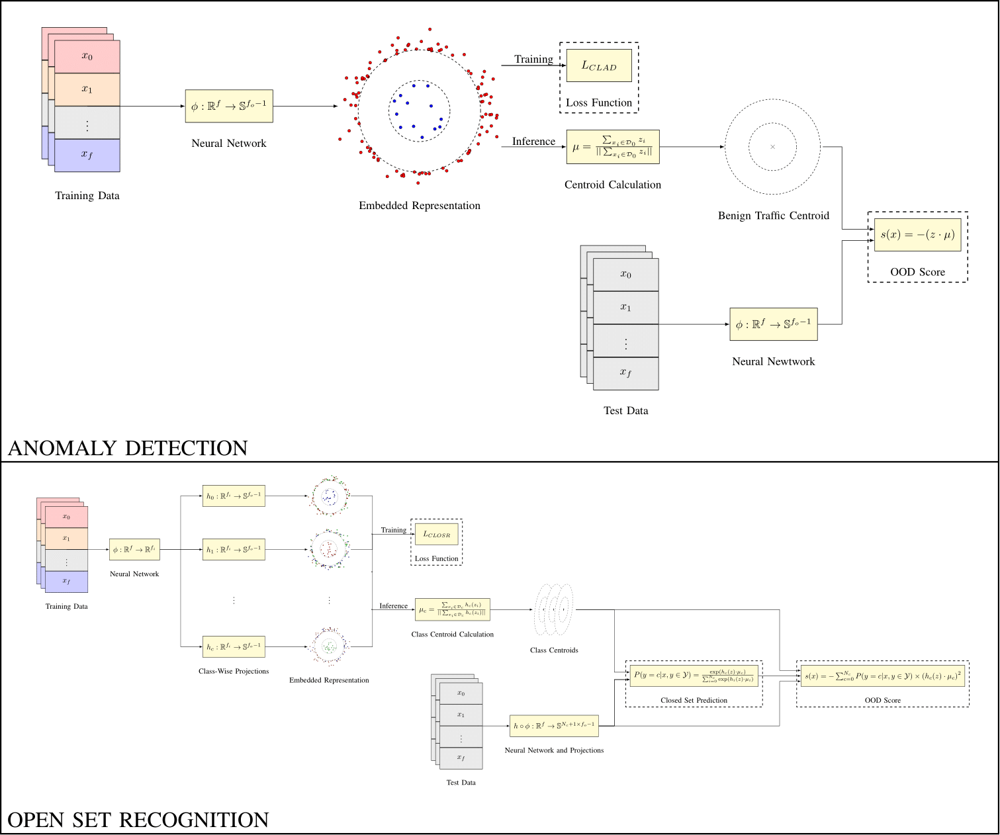
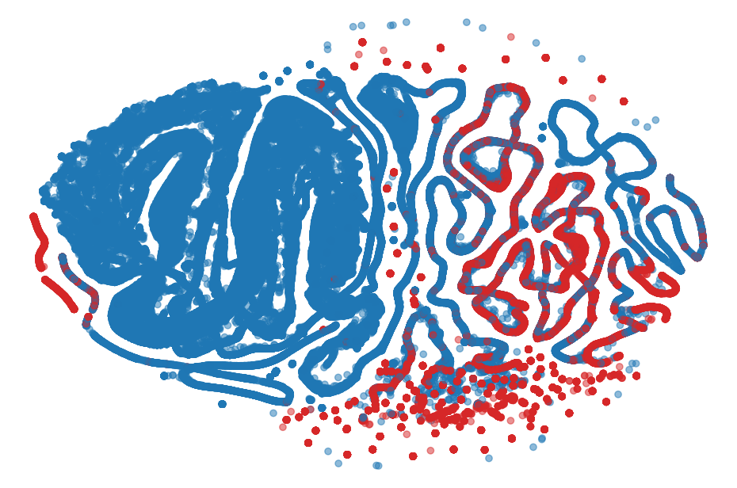
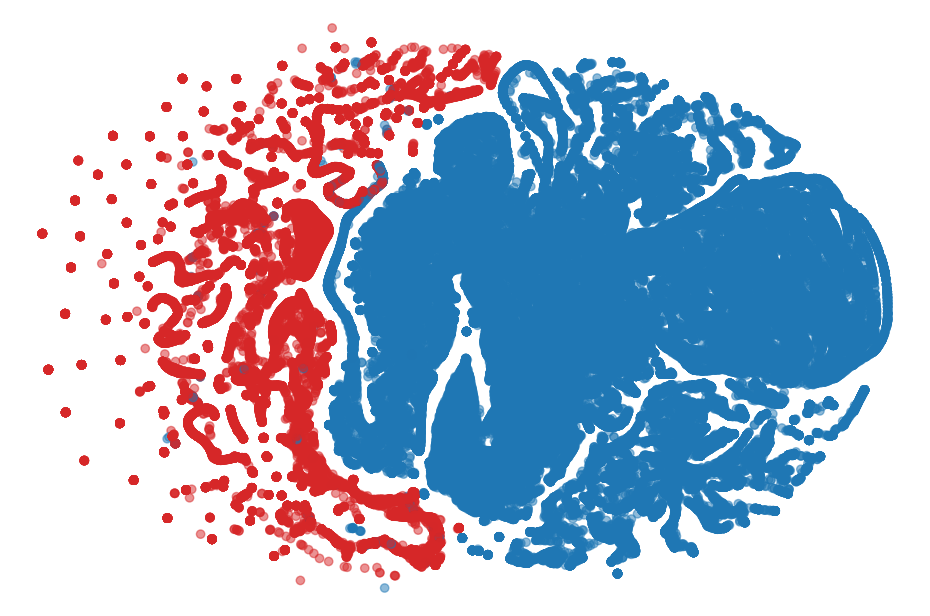

# A Novel Contrastive Loss for Zero-Day Network Intrusion Detection
<p align="center">
  
</p>

Official Github repo for the paper "A Novel Contrastive Loss for Zero-Day Network Intrusion Detection". This repository covers a reference implementation and scripts to reproduce experimental results for both the Contrastive Learning for Anomaly Detection (CLAD) and Contrastive Learning for Open Set Recognition (CLOSR) methods decribed in [this work](www.google.com).

## CLAD

## CLOSR

## Comparison
CLAD significantly outperforms both anomaly detectors on :

| Class                    | CLAD     | DUAD     | DAE-LR   | Deep SVDD | AE       | SVM      | AutoSVM  | IF       | RENOIR   | MLP      | Siamese  |
|--------------------------|----------|----------|----------|-----------|----------|----------|----------|----------|----------|----------|----------|
| Botnet                   | 0.999907 | 0.819026 | 0.759901 | 0.751007  | 0.671062 | 0.637679 | 0.641687 | 0.629887 | 0.998802 | 0.858263 | 0.999989 |
| DDoS                     | 0.999924 | 0.979402 | 0.997996 | 0.996513  | 0.908072 | 0.889780 | 0.933722 | 0.945021 | 0.998802 | 0.963565 | 0.999412 |
| DoS (Golden Eye)         | 0.999517 | 0.951141 | 0.952424 | 0.892923  | 0.855621 | 0.846840 | 0.887754 | 0.923275 | 0.998655 | 0.976192 | 0.998780 |
| DoS (Hulk)               | 0.999932 | 0.967905 | 0.994860 | 0.993388  | 0.906273 | 0.894898 | 0.926223 | 0.955478 | 0.998796 | 0.989413 | 0.999920 |
| DoS (Slow HTTP Test)     | 0.999553 | 0.954526 | 0.981080 | 0.975533  | 0.962552 | 0.963021 | 0.968576 | 0.966122 | 0.998597 | 0.970760 | 0.999757 |
| DoS (Slow Loris)         | 0.999878 | 0.929777 | 0.986823 | 0.970622  | 0.897970 | 0.896824 | 0.880789 | 0.904747 | 0.997745 | 0.937347 | 0.999876 |
| FTP Patator              | 0.999932 | 0.962427 | 0.959192 | 0.968324  | 0.765372 | 0.736828 | 0.753264 | 0.762553 | 0.998802 | 0.970197 | 0.999952 |
| Portscan                 | 0.999934 | 0.982759 | 0.983505 | 0.948716  | 0.720184 | 0.741269 | 0.668389 | 0.803987 | 0.998784 | 0.931651 | 0.999903 |
| SSH Patator (Brute Force)| 0.999906 | 0.889312 | 0.964803 | 0.962553  | 0.857118 | 0.799072 | 0.874968 | 0.845189 | 0.998802 | 0.947238 | 0.999993 |
| Web Attack (Brute Force) | 0.999738 | 0.864899 | 0.594903 | 0.673249  | 0.784379 | 0.767771 | 0.740397 | 0.713374 | 0.997332 | 0.981613 | 0.996709 |
| Web Attack (XSS)         | 0.999720 | 0.942706 | 0.564499 | 0.658500  | 0.780935 | 0.761677 | 0.730008 | 0.702785 | 0.995772 | 0.980547 | 0.995959 |
| **Closed Set Mean**      | **0.999813** | 0.931262 | 0.885453 | 0.890121  | 0.828140 | 0.812333 | 0.801366 | 0.832038 | 0.998263 | 0.955162 | 0.999114 |
| Heartbleed               | 0.982268 | 0.979357 | 0.999801 | 0.998676  | 0.989079 | 0.993468 | 0.994126 | 0.999801 | 0.498810 | 0.080487 | 0.707771 |
| Web Attack (SQL Injection)| 0.996257 | 0.830627 | 0.848514 | 0.744588  | 0.731559 | 0.745087 | 0.746270 | 0.752289 | 0.790477 | 0.946671 | 0.998434 |
| **Open Set Mean**        | **0.989263** | 0.904992 | 0.924157 | 0.871632  | 0.860319 | 0.869277 | 0.870198 | 0.876045 | 0.644643 | 0.513579 | 0.853102 |


CLOSR significantly imrpoces open set recognition performance at a slight cost to closed set classificaiton performance:

<div align="center">
| Model           | Closed Set Acc | Open Set AUC | OpenAUC          |
|------------------|----------------|---------------|------------------|
| CLOSR            | 0.994577       | 0.978625      | **0.973319**     |
| MultiStage       | 0.996577       | 0.807761      | 0.804996         |
| DOC              | 0.984475       | 0.906625      | 0.892550         |
| OPENMAX          | 0.995699       | 0.705962      | 0.702926         |
| CRSOR            | 0.995115       | 0.748929      | 0.745270         |
| Siamese Network  | 0.997649       | 0.723319      | 0.721618         |
</div>

## Running 

## t-SNE Visualisation

**(1) Standard Contrastive Loss**
<p align="center">
  
</p>

**(2) CLAD Loss**
<p align="center">
  
</p>

## Reference
```
@Article{wilkie2025clad,
    title   = {A Novel Contrastive Loss for Zero-Day Network Intrusion Detection},
    author  = {Jack Wilkie and Hanan Hindy and Christos Tachtatzis and James Irvine and Robert Atkinson},
    year    = {2025},
}
```